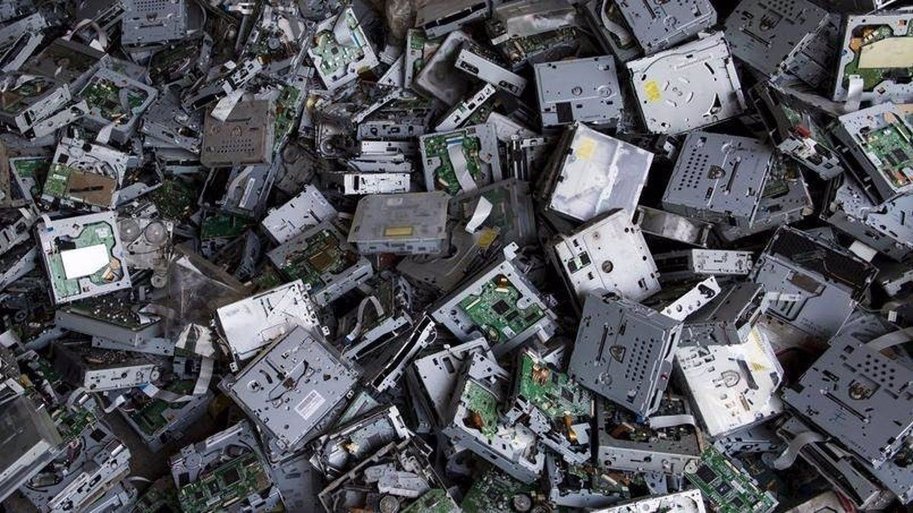

## 🚯 Residuos Informáticos 

Los desechos de dispositivos electrónicos y eléctricos (DDEE) son objetos de uso común, como cepillos de dientes eléctricos, secadores de pelo, tablets, lavadoras, teléfonos móviles, etc. que al dejar de funcionar, se convierten en desechos que tiramos y esto se convierte en basura electrónica.

La basura electrónica también constituye un problema ambiental y de seguridad. 
En primer lugar, los artículos electrónicos contienen materiales nocivos como plomo, mercurio y cadmio,  los cuales pueden ser peligrosos para el medio ambiente y la salud humana en caso de que no sean tratados adecuadamente. Además, la basura electrónica contribuye a la contaminación del suelo y de las fuentes de agua debido a la acumulación en un vertedero.

La protección de la identidad y de la información es muy importante de investigar e indagar un poco más sobre como reciclar los residuos tecnológicos, puesto que muchos de ellos contienen información personal o financiera, lo que, en caso de caer en malas manos, pueden ser utilizados para fines malintencionados. 

No toda la basura eléctrica y electrónica es igual. Algunos artículos, como ciertas máquinas y fotocopiadoras, no se pueden reciclar debido a las sustancias peligrosas que contienen.

La reutilización de materiales electrónicos y fuentes de energía desechados ahorra elementos vitales y reduce el volumen rechazado en los vertederos.

📑 _**Las 10 categorías de Aparatos Electrónicos**_

- _**Grandes electrodomésticos**_: frigoríficos, aparatos de aire acondicionado, radiadores o lavadoras.
- _**Pequeños electrodomésticos**_: aspiradoras, planchas, cafeteras o básculas.
- _**Equipos de informática y telecomunicaciones**_: ordenadores, impresoras, teclados o fax.
- _**Aparatos electrónicos de consumo y paneles fotovoltaicos**_: televisores, videocámaras o amplificadores de sonido.
- _**Aparatos de alumbrado**_: lámparas led o luminarias profesionales.
- _**Herramientas eléctricas y electrónicas**_: sierras o máquinas de coser.
- _**Juguetes o equipos deportivos y de ocio**_: trenes eléctricos o videojuegos.
- _**Productos sanitarios**_: aparatos de radioterapia o de cardiología.
- _**Instrumentos de vigilancia y control**_: detectores de humo o paneles de control.
- _**Máquinas expendedoras**_: máquinas expendedoras automáticas de bebidas o de productos sólidos.
